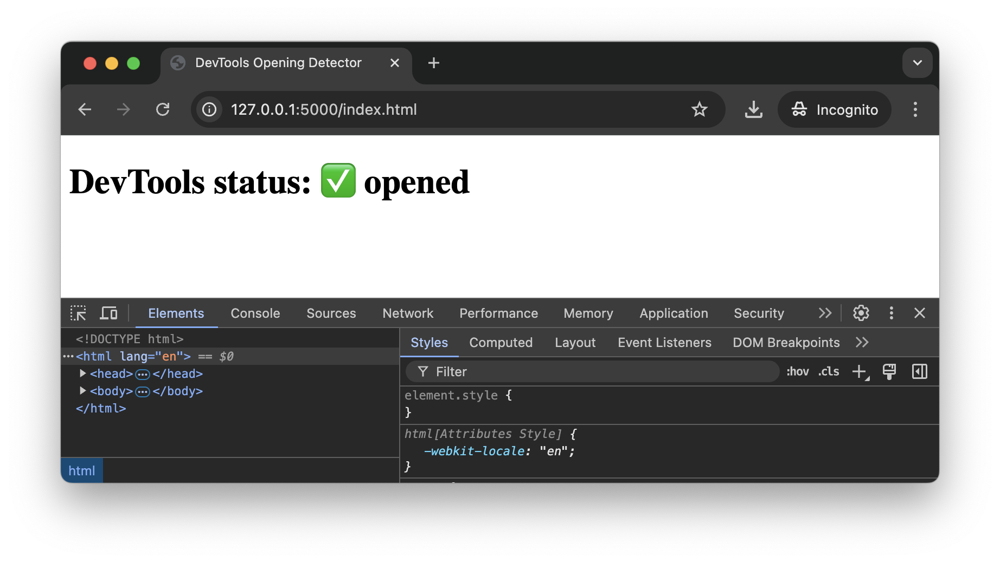

# Detect DevTools with source maps

A simple demo that uses source maps to detect when a user opens dev tools.



## How to use

1. Install Flask:

   ```shell
   pip install flask
   ```

2. Run the server:

   ```
   python server.py
   ```
3. Open [http://127.0.0.1:5000/index.html][demo-page] in the browser, and open the dev tools.

## How it works

The source map is a special file web developers create to help debug JavaScript code in production. The production code
is unreadable because we always minify it to save traffic, and the source map allows dev tools to restore the original
code by.

The browser learns the URL of the source map file from the `SourceMap <URL>` response header or
the `//# sourceMappingURL=<url>` comment at the end of a JavaScript file. When a user opens the dev tools, the browser
automatically loads the source map, which **exposes this fact to the server**.

In this demo, we use `sourceMappingURL` comment. When the server receives a request for a source map file, it sets
a special cookie. When the client detects a cookie change, it updates the text on the page.

## Test results

| Browser       | Version       | Does detection work?                             |
|---------------|---------------|--------------------------------------------------|
| Google Chrome | 129.0.6668.70 | ✅ as soon as DevTools are opened                 |
| Brave         | 129.0.6668.70 | ✅ as soon as DevTools are opened                 |
| Firefox       | 130.0.1       | ✅ only when "Debugger" tab is chosen in DevTools |
| LibreWolf     | 130.0.1-1     | ✅ only when "Debugger" tab is chosen in DevTools |

## Read more

* [What are source maps?][what-are-source-maps]
* ["Javascript Anti Debugging - Abusing SourceMappingURL"][weizmain-article] by Gal Weizman.

[demo-page]: http://127.0.0.1:5000/index.html
[weizmain-article]: https://weizmangal.com/page-js-anti-debug-1/
[what-are-source-maps]: https://web.dev/articles/source-maps
